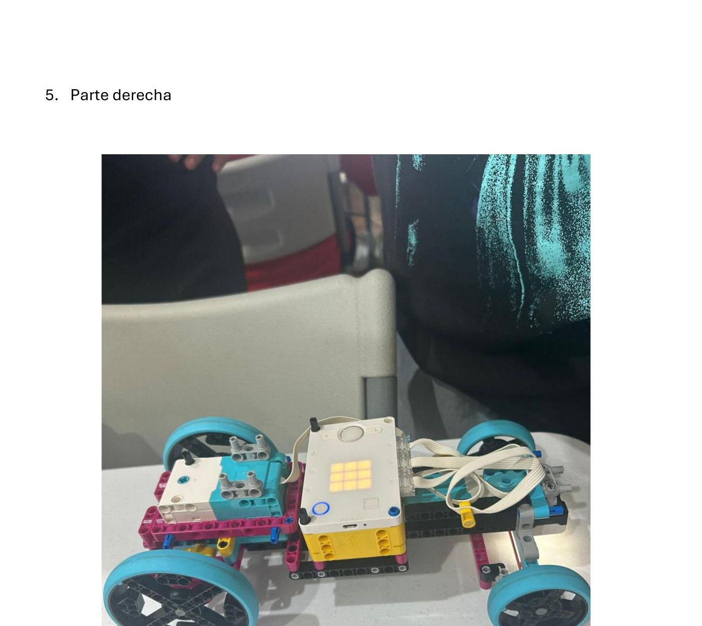
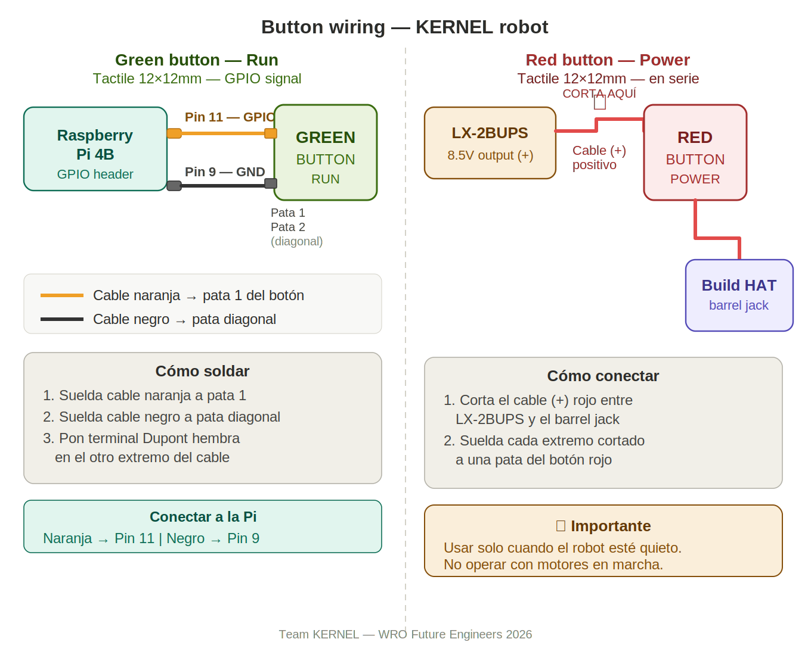
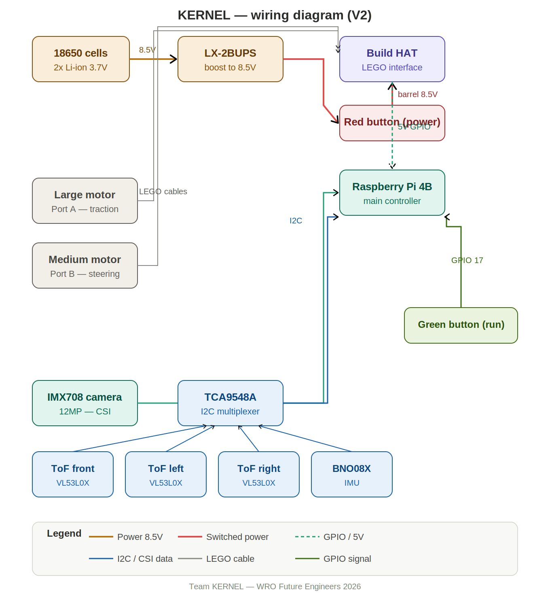

# 🤖 KERNEL — WRO Future Engineers 2026

<p align="center">
  
</p>

> **World Robot Olympiad 2026 – Future Engineers**  
> Self-Driving Cars Challenge | Barceloneta, Puerto Rico 🇵🇷

---

## 👥 The Team

| Name | Role |
|------|------|
| Nayán G. Irenes Torres | Software Development |
| Yatziel O. Rivera Álvarez | Mechanical Design |
| Jesús Montoyo Heredia | Electronics & Sensors |
| Yanrick G. Irenes Torres | Media & Documentation |

**Coach:** Carlos Olivera  
**Location:** Barceloneta, Puerto Rico  
**Category:** WRO Future Engineers 2026 (Ages 14–22)

---

## 📋 Table of Contents

1. [What the Challenge Is About](#what-the-challenge-is-about)
2. [How We Think About It](#how-we-think-about-it)
3. [How the Robot Evolved](#how-the-robot-evolved)
4. [How the Robot Is Built (V2)](#how-the-robot-is-built-v2)
5. [Power System](#power-system)
6. [Sensors](#sensors)
7. [How the Software Works](#how-the-software-works)
8. [Decisions We Made and Why](#decisions-we-made-and-why)
9. [Repository Structure](#repository-structure)
10. [How to Reproduce Our Robot](#how-to-reproduce-our-robot)

---

## 🏁 What the Challenge Is About

The WRO Future Engineers 2026 challenge requires teams to build a fully autonomous vehicle that moves completely on its own, with no one controlling it. There are two rounds:

**Round 1:** The robot has to complete 3 full laps around a square track. At each corner, the robot has to decide whether to turn right or left on its own, without knowing in advance which direction it'll be running that round.

**Round 2:** Same as Round 1, but now there are obstacles on the track. Green obstacles have to be avoided on the left, red ones on the right. At the end, the robot has to reverse-park inside a zone marked in magenta.

The hardest part is that the track changes every round, and the robot never knows exactly what it'll find. It has to make its own decisions.

---

## 💡 How We Think About It

From the start, we asked ourselves: what's better, **a complicated robot or a robot that always works?**

We chose the second one. **Simple = Reliable.**

A robot with a lot of parts has a lot of things that can break. Code that's hard to read is hard to fix the night before a competition. We applied this thinking to every decision we made; fewer mechanical parts, modular code, well-placed sensors, and testing often to catch problems early.

---

## 🔄 How the Robot Evolved

We didn't get to V2 in a straight line. The robot went through a real evolution driven by what we learned at the first regional competition.

### Robot V1 — LEGO Only

Our first version used only LEGO SPIKE Prime components:

- SPIKE Prime Hub (main controller)
- Large Motor (traction)
- Medium Motor (steering)
- Color Sensor (floor line detection)
- **Official SPIKE Prime rechargeable battery** (plugs directly into the hub)

No Raspberry Pi, no camera, no external sensors. Simple, self-contained, and powered entirely by the LEGO hub battery.

The color sensor was the bottleneck. It needed to be very close to the floor to read reliably, so close that by the time it detected a line, the robot was almost past it. And without a camera, we had no way to detect obstacles at all.

### February 21, 2026 — First Regional Competition

We competed in the first regional with V1. We couldn't get consistent lap completions; the sensor limitations were obvious on the real track. But competing was worth it. We saw the actual track, the lighting, and what we were really up against.

After the regional, we made the call: rebuild.

### Robot V2 — The Hybrid (Current)

We kept what worked and replaced what didn't:

| | V1 | V2 |
|--|----|----|
| Controller | SPIKE Prime Hub | Raspberry Pi 4B + Build HAT |
| Line detection | SPIKE Color Sensor | Arducam IMX708 12MP camera |
| Distance sensing | None | 3× VL53L0X ToF sensors |
| Orientation | None | BNO08X IMU |
| Traction motor | LEGO Large ✅ kept | LEGO Large ✅ |
| Steering motor | LEGO Medium ✅ kept | LEGO Medium ✅ |
| Wheels | LEGO | LEGO (custom 3D-printed in progress) |
| **Power** | **SPIKE hub battery** | **18650 Li-ion cells + LX-2BUPS module** |

The motors stayed — they're precise and reliable. Everything else changed.

**The power problem** was one of the hardest challenges in the transition. V1 ran off the LEGO hub's built-in rechargeable battery. Plug it in, and it works. V2 is a completely different story. The Raspberry Pi and Build HAT need an external power source, and the Build HAT specifically requires 8–12V through a barrel jack.

Finding the right battery setup took a lot of time and research. This was one of the main reasons we couldn't participate in the second regional on March 28th; we hadn't fully validated the power system in time.

### March 28, 2026 — Second Regional

We weren't able to participate. Between the power system not being fully validated and the overall state of V2 at that point, we made the call to sit this one out and keep building.

---

## ⚙️ How the Robot Is Built (V2)

### The Chassis

Built on LEGO Technic pieces, lets us adjust quickly without special tools. Approximately **250 × 150 × 110 mm**, around **600 grams**, within WRO's size limits.

**Rear-wheel drive:** two driven wheels in the back, free-spinning wheels in front. Simple and light.

### The Motors

| Motor | Port | What It Does |
|-------|------|--------------|
| SPIKE Prime Large Motor | Port A (Build HAT) | Moves the robot forward |
| SPIKE Prime Medium Motor | Port B (Build HAT) | Controls steering |

The steering motor uses absolute position control: 0° straight, +90° right, -90° left. Much more precise than time-based control, which varies with battery voltage.

### Physical Buttons

The robot has two physical buttons for competition use:

| Button | Color | Function |
|--------|-------|----------|
| Power | 🔴 Red | Cuts power between LX-2BUPS and Build HAT |
| Run | 🟢 Green | Starts `kernel_robot_r1.py` via GPIO 17 |

The green button connects to **GPIO 17 (Pin 11)** and **GND (Pin 9)** on the Raspberry Pi. 
When pressed, it triggers `boton_inicio.py`, which launches the main robot program automatically.



### The Wheels

V2 currently runs on standard LEGO wheels. The custom wheel design is in progress:

- **Rim:** PLA/PETG, ~65mm diameter, 22mm wide, designed in CAD from scratch using Fusion 360
- **Tire:** TPU (or similar flexible filament) for better grip on the competition surface

<p align="center">
  
</p>

---

## 🔋 Power System

This was one of the biggest engineering challenges of the whole project.

### V1 Power: Simple

V1 used the **official SPIKE Prime rechargeable battery** that plugs directly into the hub. No external wiring, no voltage management, nothing to figure out. Just charge it and go.

### V2 Power: A Whole Different Problem

V2 needs to power two things simultaneously:
- The **Raspberry Pi 4B** needs stable 5V
- The **Build HAT** needs 8–12V through a barrel jack

After researching options and testing different setups, our solution is **two 18650 lithium cells** connected to an **LX-2BUPS boost module**. This module outputs a stable 8.5V to the Build HAT barrel jack. The Build HAT then passes power to the Raspberry Pi through its GPIO pins — one battery source for the entire robot.

| Component | Voltage | Approximate Current |
|-----------|---------|---------------------|
| Raspberry Pi 4B | 5V | ~1.5–2.5A |
| Build HAT + motors | 8.5V | up to 3A under load |
| IMX708 Camera | 3.3V | ~0.25A |
| 3× ToF sensors | 3.3V | ~0.06A total |
| BNO08X IMU | 3.3V | ~0.01A |

### The Battery Case

To keep the power system secure on the robot, we designed and printed a custom case that holds the LX-2BUPS module and the two 18650 cells together in one unit. Having the power system loose wasn't an option for competition.

<p align="center">
  
</p>

### What We Know and What We're Still Testing

The 18650 cells have been tested, and the system works. One thing we're still validating is full endurance, how the cells perform through a complete competition run under full motor load. The cells must stay above 3.5V under load, or the Build HAT can reset. We'll find out definitively at the next regional.

We test the batteries before every session.

---

## 📡 Sensors

### Competition Setup (April 2026 Regional)

For this regional we made a deliberate decision: **run on camera only.** The Arducam IMX708 gives us everything we need to complete both rounds — line colors, obstacle colors, position, and distance. Fewer components means fewer things that can fail on competition day.

**Arducam IMX708 (12MP)** — the main and only active sensor. Connected via CSI cable, aimed forward and slightly down. Detects:
- Orange and blue floor lines → turn direction
- Red and green obstacles → bypass direction
- Position: left, center, right
- Distance: far, medium, close, very close

### Acquired and Tested (Future Integration)

We acquired, wired, and tested the following sensors on the bench. They work and will be integrated in a future version:

```
Raspberry Pi 4B
       │
  TCA9548A (I2C multiplexer)
  ├── Channel 0: VL53L0X ToF — Front
  ├── Channel 1: VL53L0X ToF — Left
  ├── Channel 2: VL53L0X ToF — Right
  └── Channel 3: BNO08X IMU
```

We confirmed that both the multiplexer (0x70) and IMU (0x4b) are detected on the I2C bus, and the IMU outputs quaternion data correctly.

| Sensor | Status | Purpose |
|--------|--------|---------|
| IMX708 12MP camera | ✅ Active | Line detection, obstacle detection, navigation |
| VL53L0X ×3 | 🔜 Future | Precise distance to obstacles and walls |
| BNO08X IMU | 🔜 Future | Heading correction and orientation |
| SPIKE Color Sensor | V1 only | Used in V1, not present in V2 |

### Wiring Diagram

<p align="center">
  
</p>

---

## 💻 How the Software Works

### One Program, Both Rounds

```
┌─────────────────────────────────────────────────────┐
│                  Raspberry Pi 4B                    │
│                                                     │
│  ┌─────────────────┐   JSON data    ┌─────────────┐ │
│  │  wro_camera.py  │ ─────────────▶ │kernel_robot │ │
│  │   (the "eyes")  │                │  _r1.py     │ │
│  │   Port 5000     │ ◀───────────── │(the "brain")│ │
│  └─────────────────┘                └─────────────┘ │
│         │                                 │         │
│    IMX708 Camera                     Build HAT       │
│                                      Motors A & B    │
└─────────────────────────────────────────────────────┘
```

- **`wro_camera.py`** — processes camera frames, detects colors, publishes JSON results on port 5000. Viewable live in any browser.
- **`kernel_robot_r1.py`** — handles **both Round 1 and Round 2** in a single program. Reads camera data every 50ms, decides what to do, and moves the motors. Round 1 logic (line following) and Round 2 logic (obstacle avoidance) are both in here.

### How It Decides at Each Corner

```
        Starts
           │
           ▼
    ┌─────────────┐
    │   Moving    │ ◀──────────────────────────┐
    │   forward   │                            │
    └──────┬──────┘                            │
           │                                   │
    Sees a colored line?                       │
           │                                   │
      ┌────┴────┐                              │
      ▼         ▼                              │
   Orange      Blue                            │
   → Turn      → Turn                          │
    right       left                           │
      └────┬────┘                              │
           ▼                                   │
    Wait 3 seconds ─────────────────────────── ┘
           │
    Reached 12 corners?
           │
           ▼
        Stop ✅  (3 laps done)
```

4 corners = 1 lap. 12 corners = 3 laps. The 3-second wait after each turn prevents the same line from being counted twice (entering and exiting the turn).

### Color Detection

HSV detection — more stable than RGB under changing lighting.

| Element | H Range | S Range | V Range |
|---------|---------|---------|---------|
| Orange line 🟠 | 8–22 | 150–255 | 100–255 |
| Blue line 🔵 | 100–130 | 150–255 | 50–255 |
| Red obstacle 🔴 | 0–10 / 170–179 | 150–255 | 80–255 |
| Green obstacle 🟢 | 45–80 | 150–255 | 50–255 |
| Parking zone 🟣 | 140–170 | 150–255 | 50–255 |

**Zone filter:** Detection of orange and blue is restricted to the bottom half of the frame. The cardboard walls that we used while testing are the same colors as the floor lines. Without this filter, the robot turned randomly every time it saw a wall.

### Code Structure

```
src/
├── kernel_robot_r1.py     # Main program
├── wro_camera.py          # Vision server
├── calibrar_colores.py    # Color calibration tool
├── sensors/
│   ├── tof.py
│   └── imu.py
└── actuators/
    └── motors.py
```

Camera server starts automatically on boot via systemd — no keyboard or screen needed.

---

## 🧠 Decisions We Made and Why

### Problems We Solved

| Problem | What Caused It | How We Fixed It |
|---------|---------------|-----------------|
| Motors didn't respond | `console=serial0,115200` in `cmdline.txt` blocked the serial port | Deleted that line |
| Camera didn't show up | CSI cable inserted backwards | Physical check every time we open the robot |
| Random turns in straight sections | Colored walls triggered line detector | Zone filter: bottom half of frame only |
| Counted corners twice | Same line detected entering and exiting | 3-second blocking window after every turn |
| Never detected anything | JSON key names didn't match between programs | Synced all names exactly |
| Couldn't find the right battery for V2 | Build HAT needs 8–12V barrel jack, no simple off-the-shelf solution | 18650 cells + LX-2BUPS module + custom printed case |

### Risks We're Managing

| Risk | How Likely | How Bad | How We Handle It |
|------|-----------|---------|-----------------|
| 18650 cells drop under full load | Medium | High — robot resets | Test before every session, spare cells ready |
| HSV ranges off at competition venue | Medium | High — robot can't navigate | `calibrar_colores.py` ready for on-site recalibration |
| Turn angle needs adjustment | Medium | Medium | Single variable `ANGULO_GIRO`, easy to tune |
| Camera cable disconnects | Low | High | Physically secured; systemd detects failure |

---

## 📁 Repository Structure

```
Kernel-FE-WRO2026/
├── README.md
├── LICENSE
├── .gitignore
├── src/
│   ├── kernel_robot_r1.py
│   ├── wro_camera.py
│   └── calibrar_colores.py
├── hardware/
│   ├── wiring_diagram.png
│   └── cad/
│       ├── rim.stl
│       ├── tire.stl
│       └── battery_case.stl
├── docs/
│   └── engineering_journal.md
└── media/
    ├── robot_v1_top.jpg
    ├── robot_v1_front.jpg
    ├── robot_v1_rear.jpg
    ├── robot_v1_left.jpg
    ├── robot_v1_right.jpg
    ├── robot_v1_bottom.jpg
    ├── robot_front.jpg
    ├── robot_top.jpg
    ├── robot_interior.jpg
    ├── robot_on_track.jpg
    ├── battery_case.jpg
    ├── wheels.jpg
    ├── test_multiplexer_imu.jpg
    ├── test_i2cdetect.jpg
    ├── test_imu_output.jpg
    └── test_color_detection.jpg
```

---

## 🔧 How to Reproduce Our Robot

### What You'll Need

- Raspberry Pi 4B (2GB RAM minimum)
- LEGO SPIKE Prime Build HAT
- SPIKE Prime Large Motor
- SPIKE Prime Medium Motor
- SPIKE Prime Color Sensor
- Arducam IMX708 12MP Camera
- 3× VL53L0X Distance Sensors
- BNO08X IMU
- TCA9548A I2C Multiplexer
- LX-2BUPS Boost Module + 2× 18650 Li-ion batteries
- LEGO Technic pieces for the chassis
- STL files in `hardware/cad/` for the battery case and optional custom wheels

### Raspberry Pi Configuration

Add to **`/boot/firmware/config.txt`**:
```
dtoverlay=imx708
dtoverlay=disable-bt
enable_uart=1
```

Remove from **`/boot/firmware/cmdline.txt`** if present:
```
console=serial0,115200
```

```bash
sudo usermod -aG dialout wro_kernel
```

### Install the Software

```bash
sudo apt update
sudo apt install python3-opencv python3-picamera2 python3-flask python3-numpy

pip3 install buildhat --break-system-packages
pip3 install adafruit-circuitpython-vl53l0x --break-system-packages
pip3 install adafruit-circuitpython-bno08x --break-system-packages
```

### Running the Robot

```bash
# Terminal 1 — Vision server
python3 src/wro_camera.py

# Terminal 2 — Main logic
sudo -E python3 src/kernel_robot_r1.py
```

### Connecting to the Robot

| Method | Address |
|--------|---------|
| Ethernet direct | `192.168.10.1` |
| Robot WiFi | Network: `WRO-KERNEL` / Password: `wrokernel2025` |
| Live camera feed | `http://192.168.10.1:5000` in a browser |

---

## 📜 License

MIT — see [LICENSE](LICENSE).

---

*KERNEL — Representing Fernando Suria Chaves High School with hard work and heart. 🇵🇷*
